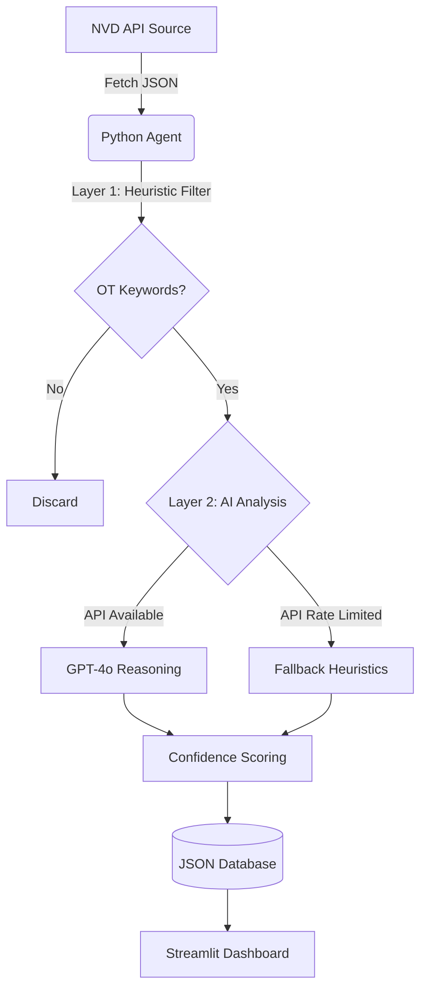

# 🛡️ ControlPoint Automated Threat Intelligence Agent

## Overview

This project is an **Autonomous AI Agent** developed for the **ControlPoint AI & Data Internship Challenge**.
It continuously monitors global vulnerability feeds (NIST NVD), filters out IT noise, and identifies **high-risk vulnerabilities affecting Operational Technology (OT) and Industrial Control Systems (ICS)**.

The agent is designed with **cost-efficiency, resilience, and explainability** in mind, making it suitable for real-world OT security monitoring.

---

## Architecture

The system follows an **ETL pipeline** enhanced with a **3-layer hybrid analysis engine**.



---

## Technical Flow

### 1️⃣ Ingestion

* The agent queries the **NIST NVD API** for CVEs published in the **last 7 days**.
* This window ensures no critical vulnerabilities are missed due to disclosure or propagation delays.

### 2️⃣ Filtration – *The 3-Layer Brain*

**Layer 1 – Gatekeeper (Zero Cost)**

* Local heuristic filtering removes ~90% of irrelevant IT noise
  (e.g., WordPress, Chrome, browsers, consumer software).

**Layer 2 – AI Semantic Analysis**

* Remaining candidates are analyzed using **OpenAI GPT-4o-mini**.
* The model evaluates real OT/ICS relevance using semantic reasoning.

**Layer 3 – Resilience Mode**

* If the OpenAI API is unavailable or rate-limited:

  * The system **automatically falls back** to a weighted keyword scoring engine.
  * Monitoring continues with **zero downtime**.

### 3️⃣ Visualization

* A **real-time Streamlit dashboard** displays:

  * CVE details
  * Vendor & product
  * OT relevance
  * **Confidence Score** (AI + heuristic weighted)
* Analysts can quickly prioritize **high-confidence OT threats**.

---

## How to Run

### Prerequisites

* Python **3.10+**
* OpenAI API Key *(optional – system runs in heuristic-only mode without it)*

---

### Installation

1️⃣ Clone the repository:

```bash
git clone https://github.com/mohameddmansurr/controlpoint-agent.git
cd controlpoint-agent
```

2️⃣ Create and activate a virtual environment:

```bash
python3 -m venv venv
source venv/bin/activate
```

3️⃣ Install dependencies:

```bash
pip install -r requirements.txt
```

4️⃣ *(Optional)* Set up your OpenAI API key:

Create a `.env` file in the root directory:

```text
OPENAI_API_KEY=your_key_here
```

---

### Running the System

Start the dashboard and agent:

```bash
streamlit run dashboard.py
```

From the Streamlit sidebar, click:
👉 **“Run Agent Scan Now”** to trigger a fresh vulnerability scan.

---

## Repository Contents

* `agent.py`
  Core logic for:

  * CVE ingestion
  * Multi-layer filtering
  * AI analysis
  * Fallback resilience logic
  * Confidence scoring

* `dashboard.py`
  Streamlit UI for:

  * Real-time visualization
  * Analyst-friendly prioritization

* `output_sample.json`
  Sample output demonstrating detection of a **critical Siemens PLC vulnerability**.

* `requirements.txt`
  Python dependencies.

---

## Key Design Principles

* ✅ **OT-First Threat Intelligence**
* ✅ **Cost-Aware AI Usage**
* ✅ **Graceful Degradation (No Downtime)**
* ✅ **Explainable Confidence Scoring**
* ✅ **Production-oriented Architecture**
